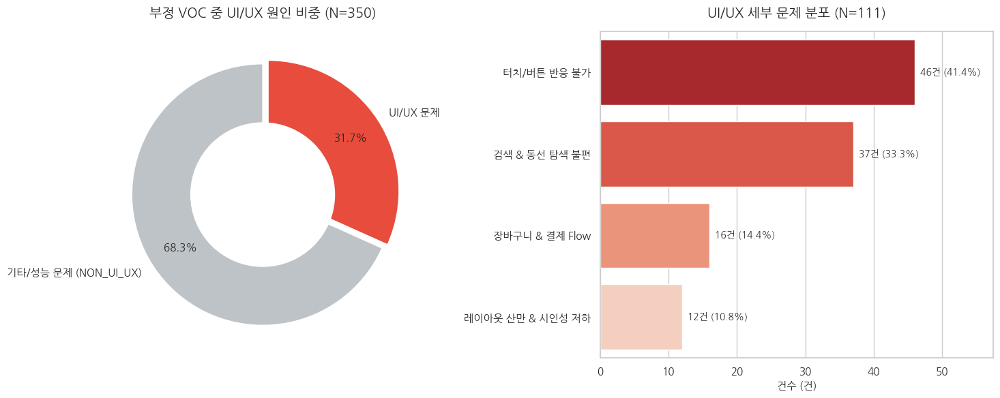
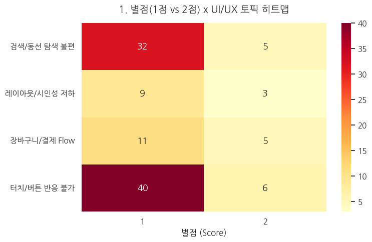
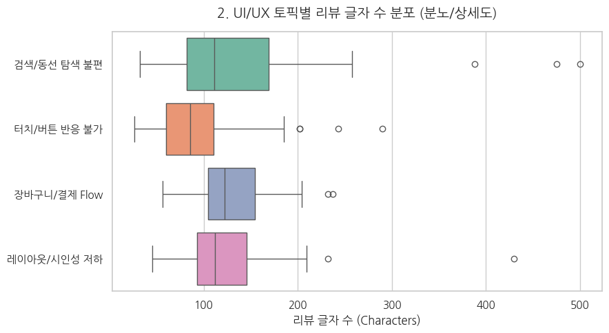
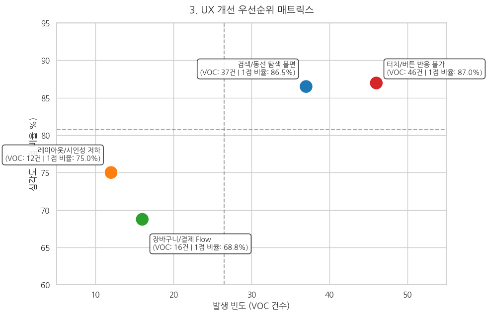
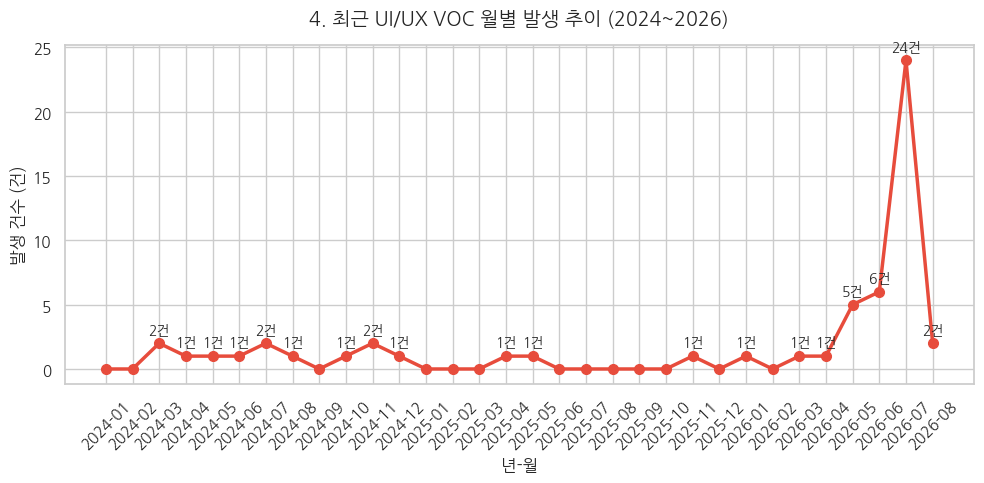

# 분석 결과: 알라딘 사용자 리뷰의 UI/UX 불편 탐색

> LLM으로 구조화한 부정적 리뷰에서 반복되는 불편을 살펴보고, 후속 사용성 검토 대상을 구체화했습니다.

## 분석 대상과 읽는 기준

- **수집:** Google Play Store 알라딘 앱의 한국어·한국 지역 리뷰를 관련도 순으로 500개 수집
- **선정:** 별점 1~2점 리뷰 350개
- **분류:** 4비트 양자화 Qwen2.5-7B-Instruct와 few-shot 프롬프트를 활용한 단일 토픽 분류
- **UI/UX 분류:** 111개 / 350개, **31.7%**
- **집계 단위:** 사용자 수나 장애 발생 수가 아니라 리뷰 수

## 1. UI/UX 관련 리뷰 비중과 세부 문제 분포

### 관찰

부정적 리뷰 350개 중 111개가 UI/UX 관련으로 분류되었습니다. 이 111개 안에서는 버튼 반응·상호작용 관련 범주와 검색·탐색 범주가 가장 많았습니다.

| UI/UX 범주 | 리뷰 수 | UI/UX 분류 111개 내 비중 |
|---|---:|---:|
| 터치/버튼 반응 불가 | 46 | 41.4% |
| 검색/동선 탐색 불편 | 37 | 33.3% |
| 장바구니/결제 흐름 | 16 | 14.4% |
| 레이아웃/시인성 저하 | 12 | 10.8% |

상위 두 범주는 83개로, UI/UX 분류 리뷰의 **74.8%**를 차지합니다. 범주별 비율은 반올림으로 합계가 100%와 다를 수 있습니다.

### 해석

이 표본에서는 화면의 시각적 구성보다 **사용자가 행동을 수행하고 원하는 항목을 찾는 과정**에 관한 리뷰가 상대적으로 많이 분류되었습니다. 버튼 반응과 탐색 동선을 후속 검토의 출발점으로 삼을 수 있습니다.

## 2. 별점과 UI/UX 범주의 관계

### 관찰

| UI/UX 범주 | 1점 | 2점 | 합계 | 범주 내 1점 비율 |
|---|---:|---:|---:|---:|
| 터치/버튼 반응 불가 | 40 | 6 | 46 | 87.0% |
| 검색/동선 탐색 불편 | 32 | 5 | 37 | 86.5% |
| 장바구니/결제 흐름 | 11 | 5 | 16 | 68.8% |
| 레이아웃/시인성 저하 | 9 | 3 | 12 | 75.0% |

UI/UX 분류 111개 중 1점 리뷰는 92개, 2점 리뷰는 19개입니다. 전체 UI/UX 분류 리뷰의 1점 비율은 **82.9%**입니다.

### 해석

터치/버튼 반응과 검색/탐색 범주는 리뷰 수가 많으면서 범주 내 1점 비율도 높습니다. 해당 불편과 강한 부정 평가가 함께 나타나는 사례를 우선 살펴볼 근거가 됩니다.

## 3. 리뷰 길이 분포

### 관찰

검색/동선 탐색 범주는 터치/버튼 반응 범주보다 중앙값이 높고, 긴 리뷰가 나타나는 쪽으로 분포가 펼쳐져 있습니다. 일부 범주에는 다른 리뷰보다 긴 관측치가 보입니다. 원본 길이 데이터가 없으므로 정확한 중앙값·사분위수는 본문에서 제시하지 않습니다.

### 해석

검색·탐색 관련 긴 리뷰에는 사용자가 원하는 항목을 찾는 과정이나 이동 경로가 상세하게 서술되어 있을 가능성이 있습니다. 후속 원문 검토에서 과업·화면·이동 순서를 추출할 후보로 활용할 수 있습니다.

## 4. 후속 UX 검토 우선순위

### 관찰

그림은 범주별 리뷰 수를 가로축, 범주 내 1점 비율을 세로축으로 배치합니다. 터치/버튼 반응과 검색/동선 탐색은 다른 두 범주보다 리뷰 수와 1점 비율이 모두 높습니다.

### 해석 및 제안

이 두 범주를 **후속 검토 후보**로 먼저 살펴볼 수 있습니다.

| 검토 후보 | 확인할 내용 |
|---|---|
| 터치/버튼 반응 | 클릭·터치 이벤트, 화면 전환, 대기 상태 표시, 오류 재현 조건 |
| 검색/동선 탐색 | 검색 과업, 메뉴의 발견 가능성, 화면 이동 경로와 깊이 |
| 장바구니/결제 흐름 | 선택 상태 유지, 뒤로 이동, 장바구니·구매 과정의 오류 |
| 레이아웃/시인성 | 정보 밀도, 글자 가독성, 주요 요소의 시각적 구분 |

위 항목은 이 문서에서 제안하는 검증 방향이며 실제 구현·개선 성과가 아닙니다.

### 주의

그림의 세로축 '심각도'는 별도의 심각도 평가가 아니라 **범주 내 1점 리뷰 비율**입니다.

## 5. 표본 내 UI/UX 리뷰의 월별 분포

### 관찰

그림에서는 2026년 5월 5개, 6월 6개, 7월 24개, 8월 2개의 UI/UX 분류 리뷰가 표시됩니다. 표시된 기간 중 2026년 7월이 가장 높습니다.

### 해석 및 후속 질문

수집 표본에서 2026년 7월 작성 리뷰가 상대적으로 많이 나타났습니다. 해당 리뷰 원문을 묶어 살펴보고, 앱 업데이트 이력이나 특정 화면·기능에 대한 언급이 함께 나타나는지 확인할 수 있습니다.

## 종합 결론

이번 분석은 비정형 사용자 리뷰를 LLM으로 구조화하여 **어떤 불편을 후속 검토할지 구체화한 탐색적 분석**입니다.

1. 선정한 부정적 리뷰 350개 중 111개(31.7%)가 UI/UX 관련으로 분류되었습니다.
2. UI/UX 분류 리뷰에서는 터치/버튼 반응과 검색/동선 탐색이 83개(74.8%)를 차지했습니다.
3. 두 범주는 1점 리뷰 비율도 높아 원문 검토와 사용성 테스트의 우선 후보가 됩니다.
4. 리뷰 길이와 작성월 분포는 추가 검토 대상을 찾는 단서이지, 심각도나 문제 발생 원인을 입증하는 지표는 아닙니다.
